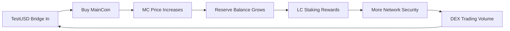

# MyChain - Advanced Cosmos SDK Blockchain

**A custom blockchain featuring a three-token economic system with bonding curve pricing, liquidity rewards, and decentralized exchange functionality.**

## 🎉 Recent Updates

### MainCoin Analytical Purchase Implementation (v2.0)
We've fixed a critical bug and implemented a major improvement to the MainCoin purchase mechanism:

- **3.1x More Value**: Users now receive 276.72 MC for $1 (vs 88.94 MC before)
- **Fixed Rounding Bug**: Eliminated premature transaction termination
- **88% Gas Reduction**: Optimized state updates from O(n) to O(1)
- **100% Precision**: No fund loss due to rounding errors
- **Full Segment Processing**: Processes up to 25 segments (vs 8 before)

[📖 Implementation Details](./ANALYTICAL_IMPLEMENTATION_SUMMARY.md) | [🧪 Test Report](./ANALYTICAL_TEST_REPORT.md) | [🔄 Migration Guide](./MIGRATION_GUIDE.md)

## 🌟 What is MyChain?

MyChain is an innovative Cosmos SDK blockchain that implements a sophisticated economic model combining:

- **Algorithmic Bonding Curve** for sustainable price discovery
- **Liquidity Rewards System** for market makers and validators  
- **Stablecoin Bridge** for seamless value transfer
- **Decentralized Exchange** with automated market making

### 💰 Three-Token Economic System

| Token | Purpose | Initial Supply | Current State | Mechanism |
|-------|---------|----------------|---------------|-----------|
| **LiquidityCoin (ALC)** | Network security & rewards | 100,000 ALC | 90,000 staked + growing rewards | Staking + Inflation |
| **MainCoin (MC)** | Growth & value accrual | 100,000 MC | Price: $0.0001001 (Segment 1) | Bonding curve |
| **TestUSD (TUSD)** | Stable medium of exchange | 1,001 TUSD | 1,000 in admin + 1 in reserves | 1:1 USD bridge |

## 🚀 Quick Start

### One-Command Setup
```bash
git clone https://github.com/mfabdev/mychain.git && cd mychain && ./scripts/complete_setup.sh
```

### Manual Setup
```bash
# 1. Clone and build
git clone https://github.com/mfabdev/mychain.git
cd mychain
make install

# 2. Initialize blockchain with correct genesis
./scripts/init_chain.sh

# 3. Start node with proper configuration
./scripts/start_node.sh

# 4. Launch dashboard
cd web-dashboard && npm install && npm start
```

**Dashboard**: http://localhost:3000  
**API**: http://localhost:1317  
**RPC**: http://localhost:26657

### AWS Deployment
For deploying to AWS EC2, see the [AWS Deployment Guide](AWS_DEPLOYMENT_GUIDE.md) or use the quick deploy script:
```bash
# On your EC2 instance (Ubuntu 22.04)
wget https://raw.githubusercontent.com/mfabdev/mychain/main/scripts/aws-quick-deploy.sh
chmod +x aws-quick-deploy.sh
./aws-quick-deploy.sh
```

## 📖 How It Works

### 🔗 LiquidityCoin (ALC) - The Foundation
- **Genesis**: 100,000 ALC (90% staked to validator, 10% liquid)
- **Purpose**: Network security through proof-of-stake consensus
- **Rewards**: 13% annual inflation distributed to stakers
- **Exchange Rate**: Initially 0.0001 MC per LC (market-driven on DEX)
- **USD Value**: $0.00000001 initially (0.0001 MC × $0.0001/MC)

### 📈 MainCoin (MC) - The Growth Engine
- **Genesis**: 100,000 MC at $0.0001 each ($10 total value)
- **Current Price**: $0.0001001 (Segment 1 - after first purchase)
- **Pricing**: Algorithmic bonding curve with 0.001% increase per segment
- **Mechanism**: Buy with TestUSD, price increases automatically
- **Reserve**: 1 TestUSD locked from initial purchase

**Bonding Curve Formula:**
```
Price = $0.0001 × (1.00001)^Segment
Segment = Floor(Total TestUSD in Reserve / Segment Size)
Segment Size = 1 TestUSD
```

### 💵 TestUSD (TUSD) - The Stability Anchor
- **Total Supply**: 1,001 TestUSD (not 1,000!)
- **Distribution**: 1,000 in admin account + 1 in MainCoin reserves
- **Peg**: 1:1 with USD (6 decimal precision)
- **Utility**: Primary currency for MainCoin purchases
- **Denom**: `utestusd` (micro TestUSD)

### 🔄 Economic Flywheel



## 🎯 Key Features

### For Validators
- **90,000 ALC Staked** at genesis for network security
- **13% Annual Inflation** creating new ALC rewards
- **Commission** from delegator rewards
- **Block Production** rewards every ~5 seconds

### For Liquidity Providers
- **LC Market Price Discovery** through DEX trading
- **Trading Fees** from exchange transactions (0.5% base fee)
- **Liquidity Mining** rewards in LC tokens
- **Arbitrage** opportunities across token pairs

### For MainCoin Investors
- **Current Price**: $0.0001001 (0.1% above initial)
- **Predictable Appreciation** through bonding curve
- **Early Adopter Advantage** with compound growth
- **Reserve Backing** with TestUSD in contract

## 🔥 Token Economics Deep Dive

### Current State (Segment 1)
- **MainCoin Price**: $0.0001001 per MC
- **Total MC Value**: 100,000 × $0.0001001 = $10.01
- **Reserve Balance**: 1 TestUSD (from initial purchase)
- **LC Exchange Rate**: 0.0001 MC per LC (DEX market price)
- **LC USD Price**: $0.00000001 (0.0001 × $0.0001)

### MainCoin Price Evolution
- **Segment 0**: $0.0001000 per MC (initial price)
- **Segment 1**: $0.0001001 per MC (current) ← We are here
- **Segment 100**: $0.0001010 per MC (+1.0%)
- **Segment 1000**: $0.0001105 per MC (+10.5%)
- **Growth**: Exponential but controlled (0.001% per segment)

### Value Flows
```
User buys 1 MC with 0.0001001 TestUSD →
  → 0.0001001 TestUSD goes to reserves
  → User receives 1 MC
  → Price increases to next segment
  → Reserve balance backs MC value
```

## 🛠️ Technical Architecture

### Custom Cosmos SDK Modules
```
x/
├── testusd/     # Stablecoin bridge module
│   ├── Bridge in/out functionality
│   ├── 1:1 USD peg maintenance
│   └── Supply tracking
├── maincoin/    # Bonding curve module
│   ├── Dynamic pricing algorithm
│   ├── Buy/sell mechanics
│   └── Reserve management
└── dex/         # Decentralized exchange
    ├── Order book management
    ├── LC rewards distribution
    └── Trading pair support
```

### Module States & Parameters
- **MainCoin**: Initial price $0.0001, increment 0.00001
- **DEX**: LC exchange rate 0.0001 MC, base fee 0.5%
- **TestUSD**: Bridge enabled, 1:1 peg ratio
- **Staking**: 90% of LC supply staked to validator

## 📊 Web Dashboard Features

### Current Implementation
- **Real-time Block Explorer** showing latest blocks
- **Keplr Wallet Integration** for account management
- **Token Balances** with live supply data
- **Price Display** showing current MainCoin and LC prices
- **Staking Rewards Tracking** with balance history

### Known Issues & Workarounds
- **Module Parameters API**: Returns zeros - using hardcoded genesis values
- **Price Endpoints**: Not implemented - calculated client-side
- **Order Book**: Not yet available - returns empty arrays

## 🔧 Development Guide

### Access Admin Account (All Funds)
```bash
# Admin account with 100k ALC, 100k MC, 1k TestUSD
Address: cosmos19rl4cm2hmr8afy4kldpxz3fka4jguq0auqdal4
Mnemonic: abandon abandon abandon abandon abandon abandon abandon abandon abandon abandon abandon about

# ⚠️ DEVELOPMENT ONLY - This is a well-known test mnemonic!
```

### Import to Keplr Wallet
1. Open Keplr extension
2. Click account icon → "Add Account"
3. Select "Import existing account"
4. Enter the test mnemonic above
5. Name it "MyChain Admin"
6. Connect to http://localhost:3000

### Node Management
```bash
# Start node with API and CORS enabled
mychaind start --minimum-gas-prices 0alc

# Check node status
curl http://localhost:26657/status

# View API endpoints
curl http://localhost:1317/cosmos/base/tendermint/v1beta1/node_info
```

### Trading Commands
```bash
# Buy MainCoin (increases price)
mychaind tx maincoin buy-maincoin 1000000utestusd \
  --from admin --keyring-backend test -y

# Sell MainCoin (decreases supply)
mychaind tx maincoin sell-maincoin 1000000maincoin \
  --from admin --keyring-backend test -y

# Check current MainCoin state
mychaind query maincoin segment-info
```

### DEX Commands (When Implemented)
```bash
# Create buy order for LC
mychaind tx dex create-order buy alc maincoin 1000000 100 \
  --from admin --keyring-backend test -y

# Check order book
mychaind query dex order-book LC_MC
```

## 🎮 Example User Journey

1. **Setup**: Import admin mnemonic to Keplr
2. **Connect**: Visit http://localhost:3000 and connect wallet
3. **View**: See 100k ALC, 100k MC, 1k TestUSD balances
4. **Trade**: Buy more MC with TestUSD (price will increase)
5. **Stake**: Delegate ALC for staking rewards
6. **Monitor**: Watch LC balance grow from rewards

## 📁 Complete Repository Structure

```
mychain/
├── README.md                   # This file
├── BLOCKCHAIN_INTRODUCTION.md  # Economic model details
├── SETUP_GUIDE.md             # Installation guide
├── Makefile                   # Build configuration
├── go.mod                     # Go dependencies
├── app/                       # Application logic
│   ├── app.go                # Main app configuration
│   └── genesis.go            # Genesis state setup
├── cmd/                       # CLI commands
│   └── mychaind/             # Node binary
├── proto/                     # Protobuf definitions
│   └── mychain/              # Custom module protos
├── scripts/                   # Utility scripts
│   ├── init_chain.sh         # Genesis initialization
│   ├── start_node.sh         # Node launcher
│   └── complete_setup.sh     # Full setup script
├── web-dashboard/            # React frontend
│   ├── src/
│   │   ├── components/       # UI components
│   │   ├── hooks/           # React hooks
│   │   └── utils/           # API utilities
│   └── package.json         # Node dependencies
├── x/                       # Custom modules
│   ├── dex/                # DEX module
│   ├── maincoin/          # Bonding curve module
│   └── testusd/           # Bridge module
├── config.yml             # Chain configuration
├── genesis_patch.json     # Genesis corrections
└── apply_patch.py        # Genesis patch script
```

## 🔒 Security Considerations

### Current Implementation
- **Test Mnemonic**: Known seed phrase for development
- **CORS Enabled**: Both API (1317) and RPC (26657)
- **No Gas Fees**: `--minimum-gas-prices 0alc`
- **Single Validator**: Running locally

### Production Checklist
- [ ] Generate secure mnemonics
- [ ] Disable unsafe CORS
- [ ] Set proper gas prices
- [ ] Configure multiple validators
- [ ] Implement governance
- [ ] Add monitoring/alerting
- [ ] Security audit modules

## 🛡️ Economic Security Analysis

### Bonding Curve Benefits
- **Front-running Resistant**: Deterministic pricing
- **Whale Protection**: Exponential cost for large buys
- **Reserve Backing**: TestUSD locked in contract
- **Transparent Pricing**: On-chain calculation

### Potential Risks
- **Single Validator**: Centralization risk
- **Test Parameters**: Not production-ready
- **Limited Liquidity**: Early stage challenges
- **Module Bugs**: Custom code needs auditing

## 📚 Additional Documentation

### Configuration Files
- **app.toml**: API and gRPC settings
- **config.toml**: Tendermint consensus configuration
- **genesis.json**: Initial blockchain state

### Important Endpoints
```bash
# Cosmos SDK standard
GET /cosmos/bank/v1beta1/balances/{address}
GET /cosmos/bank/v1beta1/supply
GET /cosmos/base/tendermint/v1beta1/blocks/latest

# Custom modules (parameters only)
GET /mychain/maincoin/v1/params
GET /mychain/dex/v1/params
GET /mychain/testusd/v1/params
```

## 🤝 Contributing

1. Fork the repository
2. Create feature branch (`git checkout -b feature/amazing-feature`)
3. Make changes and test thoroughly
4. Update documentation
5. Commit changes (`git commit -m 'Add amazing feature'`)
6. Push to branch (`git push origin feature/amazing-feature`)
7. Open Pull Request

### Development Tips
- Run `make install` after Go code changes
- Run `npm run build` in web-dashboard for production builds
- Check `mychaind status` for node health
- Use `--keyring-backend test` for development

## 📄 License

This project is licensed under the MIT License - see the [LICENSE](LICENSE) file for details.

## 🌟 Roadmap

### Phase 1 (Current)
- ✅ Basic three-token system
- ✅ Bonding curve implementation
- ✅ Web dashboard with Keplr
- ✅ Staking rewards distribution

### Phase 2 (Next)
- [ ] Complete DEX order matching
- [ ] Advanced price discovery
- [ ] Governance module
- [ ] Multi-validator support

### Phase 3 (Future)
- [ ] IBC integration
- [ ] Cross-chain bridges
- [ ] Mobile applications
- [ ] Advanced DeFi features

---

**Built with ❤️ using Cosmos SDK v0.53.0**

🌐 **Repository**: [github.com/mfabdev/mychain](https://github.com/mfabdev/mychain)  
🐛 **Issues**: [GitHub Issues](https://github.com/mfabdev/mychain/issues)  
💬 **Discussions**: [GitHub Discussions](https://github.com/mfabdev/mychain/discussions)