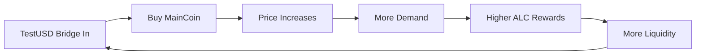

# MyChain - Advanced Cosmos SDK Blockchain

**A custom blockchain featuring a three-token economic system with bonding curve pricing, liquidity rewards, and decentralized exchange functionality.**

## 🌟 What is MyChain?

MyChain is an innovative Cosmos SDK blockchain that implements a sophisticated economic model combining:

- **Algorithmic Bonding Curve** for sustainable price discovery
- **Liquidity Rewards System** for market makers and validators  
- **Stablecoin Bridge** for seamless value transfer
- **Decentralized Exchange** with automated market making

### 💰 Three-Token Economic System

| Token | Purpose | Supply | Mechanism |
|-------|---------|--------|-----------|
| **LiquidityCoin (ALC)** | Network security & rewards | 100,000 | Staking + Inflation |
| **MainCoin (MC)** | Growth & value accrual | 100,000 | Bonding curve |
| **TestUSD (TUSD)** | Stable medium of exchange | 1,000 | 1:1 USD bridge |

## 🚀 Quick Start

### One-Command Setup
```bash
git clone https://github.com/mfabdev/LQC.git && cd LQC && ./scripts/complete_setup.sh
```

### Manual Setup
```bash
# 1. Clone and build
git clone https://github.com/mfabdev/LQC.git
cd LQC
make install

# 2. Initialize blockchain
./scripts/init_chain.sh

# 3. Start node
./scripts/start_node.sh

# 4. Launch dashboard
cd web-dashboard && npm install && npm start
```

**Dashboard**: http://localhost:3000

## 📖 How It Works

### 🔗 LiquidityCoin (ALC) - The Foundation
- **Genesis**: 100,000 ALC (90% staked, 10% liquid)
- **Purpose**: Network security through proof-of-stake
- **Rewards**: Block production rewards + DEX liquidity mining
- **Burning**: Transaction fees create deflationary pressure

### 📈 MainCoin (MC) - The Growth Engine
- **Genesis**: 100,000 MC at $0.0001 each ($10 total value)
- **Pricing**: Algorithmic bonding curve with predictable appreciation
- **Mechanism**: Buy with TestUSD, price increases with demand
- **Burning**: Selling burns tokens, reducing supply permanently

**Bonding Curve Formula:**
```
Price = $0.0001 × (1 + 0.00001)^Segment
Segment = Floor(Current Supply / Segment Size)
```

### 💵 TestUSD (TUSD) - The Stability Anchor
- **Genesis**: 1,000 TestUSD for initial trading
- **Peg**: 1:1 with USD via bridge mechanism
- **Utility**: Primary currency for MainCoin purchases
- **Stability**: Maintained through arbitrage and external reserves

### 🔄 Economic Flywheel



## 🎯 Key Features

### For Validators
- **13% Annual Staking Rewards** from ALC inflation
- **Commission** from delegator rewards
- **MEV Opportunities** from transaction ordering

### For Liquidity Providers
- **DEX Rewards** in ALC tokens for providing liquidity
- **Trading Fees** from exchange transactions
- **Arbitrage** opportunities across token pairs

### For MainCoin Investors
- **Predictable Appreciation** through bonding curve
- **Early Adopter Advantage** with lower entry prices
- **Scarcity Value** from token burning on sales

## 🔥 Token Economics Deep Dive

### MainCoin Price Evolution
- **Segment 1**: $0.0001 per MC (launch price)
- **Segment 100**: $0.0001 × 1.00001^100 = $0.000101 per MC
- **Segment 1000**: $0.0001 × 1.00001^1000 = $0.000111 per MC
- **Growth**: Exponential but controlled appreciation

### Burning Mechanisms
- **MainCoin**: Burned when sold back to bonding curve
- **LiquidityCoin**: Transaction fees burned
- **TestUSD**: No burning (maintains peg stability)

### Value Accrual
```
Total Network Value = 
  (ALC Supply × ALC Price) + 
  (MC Supply × Bonding Curve Price) + 
  (TestUSD Supply × $1.00)
```

## 🛠️ Technical Architecture

### Cosmos SDK Modules
```
app/
├── testusd/     # Stablecoin bridge with 1:1 USD peg
├── maincoin/    # Bonding curve with dynamic pricing  
└── dex/         # Order book + liquidity rewards
```

### Key Components
- **Proof of Stake** consensus with ALC token
- **IBC Integration** for cross-chain compatibility
- **gRPC/REST APIs** for external integrations
- **Web Dashboard** with Keplr wallet integration

## 📊 Web Dashboard Features

- **Real-time Block Explorer** with live updates
- **Keplr Wallet Integration** for seamless transactions
- **Token Portfolio** with live balances and prices
- **DEX Interface** for trading and liquidity provision
- **Staking Dashboard** for delegation management

## 🔧 Development Commands

### Node Management
```bash
# Start/stop node
./scripts/start_node.sh
./scripts/stop_node.sh

# Check status
mychaind status

# View logs
tail -f node.log
```

### Trading Commands
```bash
# Buy MainCoin with TestUSD
mychaind tx maincoin buy-maincoin 1000000utestusd --from admin --keyring-backend test -y

# Sell MainCoin for TestUSD  
mychaind tx maincoin sell-maincoin 1000000maincoin --from admin --keyring-backend test -y

# Create DEX order
mychaind tx dex create-order buy maincoin utestusd 1000000 100 --from admin --keyring-backend test -y
```

### Query Commands
```bash
# Check balances
mychaind query bank balances $(mychaind keys show admin --keyring-backend test -a)

# Check MainCoin price
mychaind query maincoin current-price

# Check DEX orders
mychaind query dex order-book maincoin utestusd
```

## 🎮 Example User Journey

1. **Entry**: Bridge $100 USDC → 100 TestUSD
2. **Investment**: Buy MainCoin with 50 TestUSD at current price
3. **Liquidity**: Provide ALC/TestUSD liquidity for rewards
4. **Growth**: MainCoin price rises as ecosystem grows
5. **Rewards**: Earn ALC from DEX participation
6. **Exit**: Sell positions with potential profit

## 📁 Repository Structure

```
LQC/
├── BLOCKCHAIN_INTRODUCTION.md  # Detailed economic explanation
├── SETUP_GUIDE.md             # Step-by-step setup instructions
├── scripts/                   # Management and setup scripts
├── web-dashboard/             # React TypeScript frontend
├── x/                         # Custom Cosmos SDK modules
├── proto/                     # Protobuf definitions
├── app/                       # Application configuration
└── docs/                      # Additional documentation
```

## 🔒 Security Considerations

### Development Warnings
- **Test Mnemonic**: `abandon abandon abandon abandon abandon abandon abandon abandon abandon abandon abandon about`
- **Admin Address**: `cosmos19rl4cm2hmr8afy4kldpxz3fka4jguq0auqdal4`
- ⚠️ **Never use the test mnemonic for real funds!**

### Production Deployment
- Generate secure validator keys
- Implement proper key management
- Configure appropriate governance parameters
- Set up monitoring and alerting

## 🛡️ Economic Security

### Attack Resistance
- **Bonding Curve**: Prevents pump-and-dump schemes
- **Burning Mechanism**: Creates deflationary pressure
- **Staking Requirements**: Aligns validator incentives
- **Diversified Utility**: Multiple value sources

### Sustainability Features
- **Self-Reinforcing Growth**: Success attracts more users
- **Multiple Revenue Streams**: Staking, trading, arbitrage
- **Adaptive Pricing**: Responds to supply and demand
- **Long-term Incentives**: Rewards early participants

## 📚 Documentation

- **[Blockchain Introduction](BLOCKCHAIN_INTRODUCTION.md)** - Technical deep dive
- **[Setup Guide](SETUP_GUIDE.md)** - Detailed installation instructions
- **[Dashboard Guide](web-dashboard/DASHBOARD_README.md)** - Frontend documentation

## 🤝 Contributing

1. Fork the repository
2. Create feature branch (`git checkout -b feature/amazing-feature`)
3. Commit changes (`git commit -m 'Add amazing feature'`)
4. Push to branch (`git push origin feature/amazing-feature`)
5. Open Pull Request

## 📄 License

This project is licensed under the MIT License - see the [LICENSE](LICENSE) file for details.

## 🌟 Features Roadmap

- [ ] Cross-chain IBC integration
- [ ] Advanced DEX features (limit orders, stop-loss)
- [ ] Governance module for parameter updates
- [ ] Mobile app development
- [ ] Additional stablecoin bridges

---

**Built with ❤️ using Cosmos SDK • Join the future of decentralized finance**

🌐 **Live Demo**: [GitHub Pages](https://mfabdev.github.io/LQC)
🐛 **Issues**: [GitHub Issues](https://github.com/mfabdev/LQC/issues)
📧 **Contact**: [Project Discussions](https://github.com/mfabdev/LQC/discussions)